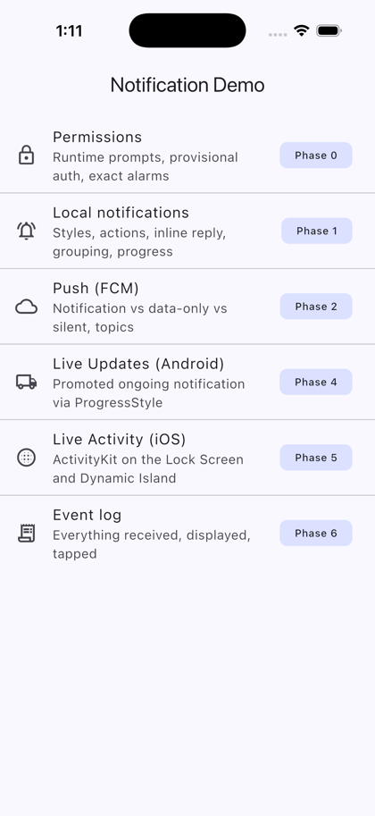
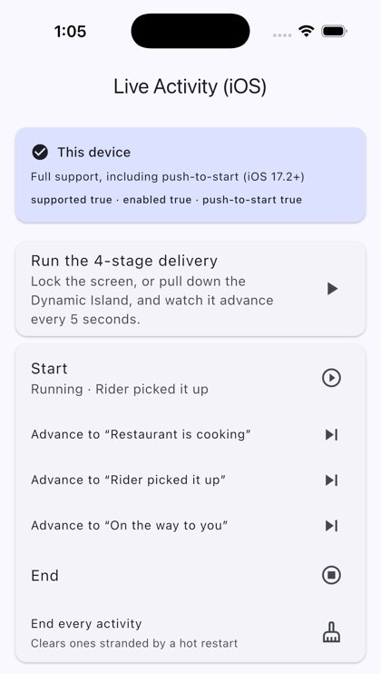
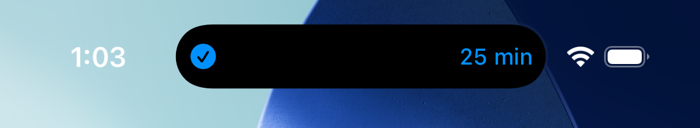
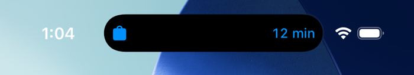
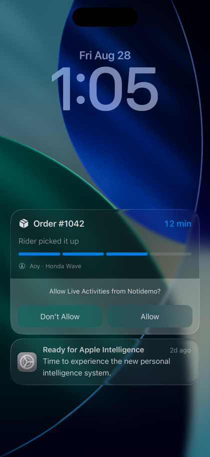
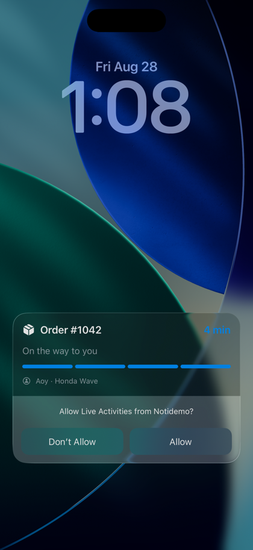
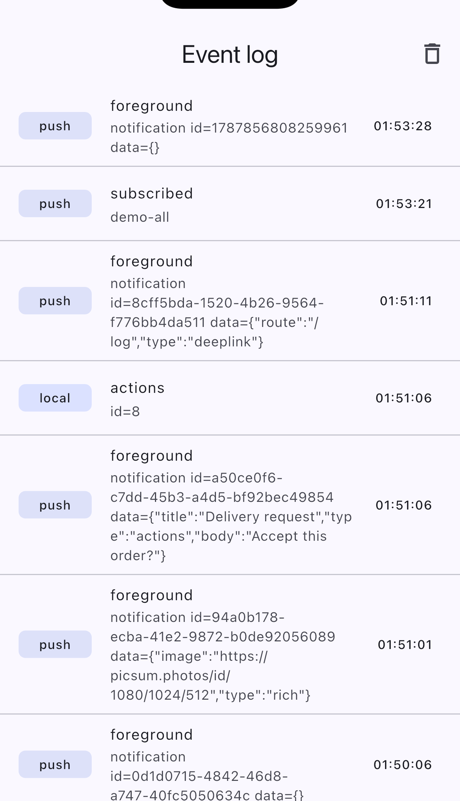

# Screenshots — Phase 5 evidence

Captured **2026-08-28** on an **iPhone 17 Pro simulator, iOS 26.5**, Xcode 26.6,
Flutter 3.47.1, debug build, bundle ID `com.f0h.flt-noti-demo`.

These exist because `docs/DECISIONS.md` has a standing rule: *do not mark iOS verified on
reasoning alone.* Every claim in `docs/TESTING.md` about the iOS half being working is
backed by one of the images below.

The Live Activity shots are driven **locally, from inside the app** — no APNs, no FCM, no
backend. `ios-push-event-log.png` is the exception: that one is real traffic from the
deployed backend, and is the only surviving record of it.

Device tokens are cropped out rather than shown, per the redaction rule in
`docs/DECISIONS.md`.

---

## The app

| | |
|---|---|
|  |  |

Left: Phase 4 and Phase 5 are separate entries — Android Live Updates and iOS Live
Activities are different mechanisms and deserve to be compared, not merged.

Right: the capability probe reporting `supported true · enabled true · push-to-start
true`, and the manual stage controls. The card below the fold — cropped here — carries
the three tokens.

## Dynamic Island, before and after an update

Stage 0 (`checkmark.circle.fill`, 25 min) and stage 2 (`bag.fill`, 12 min), the same
activity after two `updateActivity` calls.

**This pair is the one worth keeping.** The plugin's `ContentState` carries only the App
Group id and never changes between these two frames — every field on screen is read by
the widget process out of the shared `UserDefaults`. The obvious worry is that ActivityKit
would coalesce an update whose state is byte-identical and never re-render. It does not.
See `docs/DECISIONS.md`, *Live Activity fields travel through the App Group*.

## Lock Screen

| Mid-run | Final stage |
|---|---|
|  |  |

Title, stage label, four-segment bar matching the Android `ProgressStyle` segments, ETA,
rider.

The *"Allow Live Activities from Notidemo?"* prompt in the left-hand shot is iOS asking on
first use. Note that the activity is **already drawn above it** — the prompt governs
later ones, so a first run looks like this and is not a failure.

Right-hand shot is the end of a full `runLocalSequence()`: all four segments filled,
`4 min`, immediately before `endActivity`.

## Real push traffic, from the backend that no longer exists

Taken while the AWS backend was still up, minutes before `terraform destroy`. Reading
upward: the topic push after subscribing, the deep link arriving as `data={"route":"/log",
"type":"deeplink"}`, the `actions` push being rebuilt locally as `[local] actions id=8`
because buttons cannot ride on a notification message, and the rich push carrying its
image URL in `data` — where it stays, since there is no Notification Service Extension to
fetch it.

What is **not** in this list is the point: no `data`, no `silent`, and none of the four
`delivery_step` messages. Those all reached the device and were refused by iOS, because
`content-available` pushes are not delivered on a simulator. `docs/TESTING.md` has the
log line and the reproduction.
